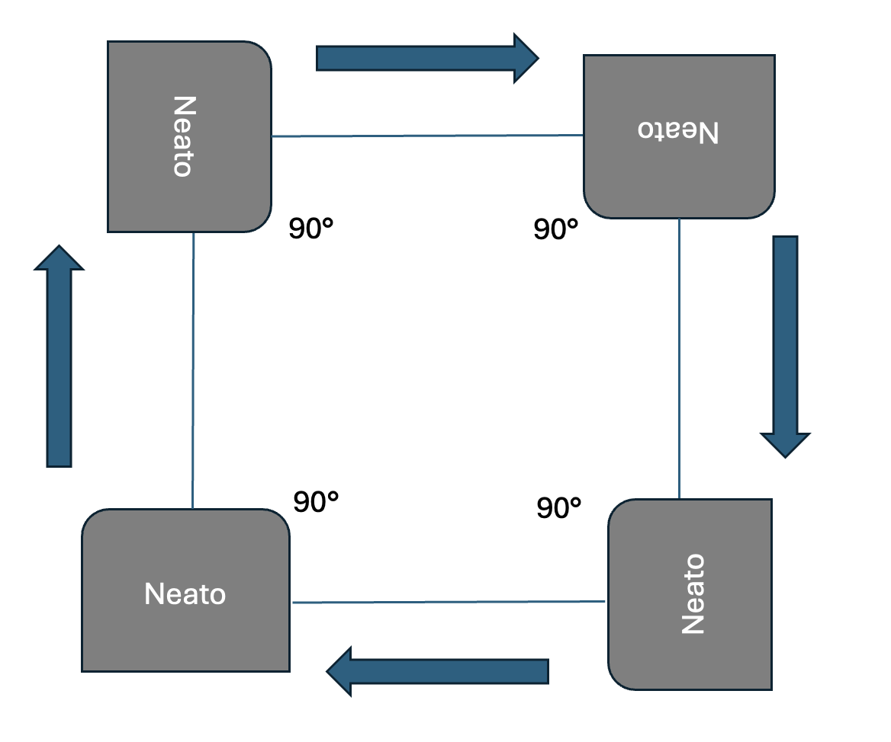

# CompRobo FA25: Robo Behaviors Warmup Project

*Chang Jun Park*\
*Ashley Yang*

## Project Overview

You’ll find four behavior nodes — `teleop`, `drive_square`, `wall_follower`, and `person_follower` — plus an `fsm` node that acts sort of like a mux for `/cmd_vel`. A launch file starts them all at once and wires up topic remappings so they don’t overlap each other.


Each behavior publishes to its own private velocity topic. The FSM subscribes to all of those, picks exactly one based on the current mode, and republishes that one to the global `/cmd_vel`. The FSM also publishes the current mode on `fsm/state` so behaviors can be activated/deactivated according to the current state. We also ensured that switching modes always include a stop so hand‑offs are clean.

## Launching & switching modes

The launch file starts all behaviors plus the FSM and sets up remaps so only the FSM owns `/cmd_vel`.

```bash
ros2 launch robobehaviors_fsm fsm_launch.py
```

You can flip modes either by publishing to `behavior_mode`:

```bash
# Teleop
ros2 topic pub /behavior_mode std_msgs/String "data: teleop"

# Square
ros2 topic pub /behavior_mode std_msgs/String "data: square"

# Wall follower
ros2 topic pub /behavior_mode std_msgs/String "data: wall"

# Idle / Estop
ros2 topic pub /behavior_mode std_msgs/String "data: idle"
ros2 topic pub /behavior_mode std_msgs/String "data: estop"
```

…or by setting the `mode` parameter (which is the option we prefer!):

```bash
ros2 param set /behavior_fsm mode teleop
```

You can watch the current mode on:

```bash
ros2 topic echo /fsm/state
```

## Teleop

### Implementation

`teleop.py` is a simple keyboard driver. When the FSM says the system is in **TELEOP**, the node flips an internal switch and listens for single key presses from the terminal. It uses raw TTY mode and `select()` so it can check for keys without blocking ROS callbacks. Keys map straight to a `geometry_msgs/Twist` which translates to velocity and turn:


- **8** drives forward at +0.3 m/s; **2** drives backward at −0.3 m/s.
- **4** spins left at +1.0 rad/s; **6** spins right at −1.0 rad/s.
- **7**/**9** do a forward + turn (left/right). **1**/**3** do a reverse + turn.
- **5** is an immediate stop.
- **Ctrl‑C** publishes one last zero and exits cleanly.

Teleop only publishes when keys change, so it leans on the FSM’s stop behavior (and the **5** key) to make sure the Neato doesn’t dwell on a key between repeats. The moment the FSM leaves **TELEOP**, the node publishes a zero and goes idle.

### Challenges

Launching the full stack with `ros2 launch` initially caused the teleop node to crash immediately with `termios.error: (25, 'Inappropriate ioctl for device')`. The original code unconditionally called `termios.tcgetattr(sys.stdin)`, assuming an interactive TTY. After Googling this issue, we discoverd that under the launch system, `stdin` is often a pipe, so those input/output calls failed and killed the process. We fixed this by guarding all terminal operations with `sys.stdin.isatty()`. If no TTY is present we log a warning, disable keyboard reading, and just spin callbacks so the node can still react to FSM state changes and publish a safe stop when deactivated. When run directly with `ros2 run` (a real terminal), full keyboard control works exactly as before. Therefore, for this mode specifcally, we had to launch the FSM then have a seperate terminal open to run the node.


## Drive Square

### Implementation 

`drive_square.py` implements a node to have the Neato continuously drive in the shape of a square for as long as the corresponding mode is set. It uses a thread-based approach to sequence the alternating steps of turning left and driving forward at fixed velocities and distances, activating from an Event coming from the FSM manager.



The node, subscribed to fsm/state, listens for when the message coming from the topic publishes SQUARE to begin driving. On activation, the node executes its main driving logic of going straight forward a specified distance of 0.25 meters, then turning to make a 90 degree left turn, repeating these two steps continuously to draw squares. To go straight or turn, the linear or angular velocity of the Neato is set to preset values (0.7 m/s for linear, 0.5 m/s for angular), and the time for how long the Neato would take to drive the desired distance and angle is calculated; the process then sleeps for that duration so that the Neato drives at the specified velocities for the necessary amount of time before both velocities are set to 0 to stop.

### Challenges

While the implementation of this behavior was largely smooth, there was an initial challenge of thinking through the thread-based implementation of the node. In particular, there was some work done in understanding how an Event can impact the main running loop thread.

## Wall Follower

### Implementation

`wall_follower.py` keeps the Neato roughly parallel to the nearest side wall using just two lidar scans per side and proportional correction. It also has a tiny recovery state machine using the bump sensors on the Neato.


When the FSM publishes **WALL**, the node starts processing `sensor_msgs/LaserScan` and running its control loop. It samples symmetric lidar bearings on each side: left at **+90°−offset and +90°+offset**, right at **−90°+offset and −90°−offset** , with the offset set at **35°**. If both readings on a side are valid, it computes front minus back to measure how crooked the Neato is. A value near zero means you’re parallel; a positive value means the nose is farther from the wall (turn toward it a bit); a negative value means the nose is closer (turn away a bit). That difference is scaled by a proportional gain (`k_parallel` = 0.8) to produce `angular.z`. Additionally, when a wall is available, the Neato drives forward at 0.1 m/s; otherwise, it creeps at 0.08 m/s until it finds one.

```
err_parallel = rf - rb
az = -self.k_parallel * err_parallel
```

There’s a **"mini-FSM"** that helps the Neato recover after bumping into an obstacle using the bump sensors:
- **FOLLOW** is the normal mode described above.
- A bump to some obstacle switches to **BACKING**, which makes the Neato back away with a slight turn away from the hit side.
- Then it transitions to **RECOVER_TURN**, turning away from the hit side, after which it returns to **FOLLOW** and searches for a good wall.

### Challenges

Tuning this mode mostly came down to picking good values for `k_parallel` and `pair_offset_deg`. We tested several proportional gains to smooth out corrections: if the gain was too high, the robot overshot; if it was too low, it responded sluggishly. The offset angle needed the same care: it sets where the two side rays land on the wall, so if it’s too small the readings get noisy and don’t capture tilt well, and if it’s too large the rays miss useful geometry (or catch doors/corners). After some trial and error, we settled on values that keep turns steady without overshoot and focus the scan on the wall area that actually matters.

## Person Follower

### Implementation 

`person_follower.py` implements a node to have the Neato follow a "person" within a certain range around. A thread-based approach is used to continuously process LIDAR scans from the Neato, calculate the closest point within a determined range of the Neato, and move the Neato close to that point. 


The node is subscribed to the /scan topic, and uses incoming messages to get our angles and distances from the LIDAR readings. We constrain our Neato to consider a particular person tracking region, where the person has to be within the region to be tracked. We chose 90 degrees to -90 degrees clockwise as our set of scan angles to consider for the region, as it roughly corresponds to the front of the Neato, while the maximum distance for the region is capped at 1.5 meters. In order to determine where the person is, the minimum distance of the scans is found and that point is picked as the target "person". The Neato turns to the specified angle, and then moves straight to the point, stopping right before collision. This repeats to have the Neato track and follow the "person".

The Neato is designed to stop when the distance is below 0.30m; from quick simulation tests, 0.24 m or 0.25 m is how far away the Neato thinks it is from the person, even though it looks like it's actively hitting the person. Leaving the buffer accounts for that offset from the LIDAR scanning placement, to remove unnecessary turning and movement when the Neato LIDAR scans don't read as hitting the person, even though it is. 

Given more time, it would be interesting to see how a more gradual proportional control with distance and speed could be implemented; as of now, the Neato is designed to go half the distance to the object to be able to adapt more often.

### Challenges

Ensuring a consistent behavior result for this mode came down to making multiple modifications to the LIDAR scanning processing, in order to ensure that they were filtered correctly to our desired range. Since we want a precise area to consider where a person is, the LIDAR scans need to be both filtered based on predetermined angles as well as the distances received from the scanning. 

Conceptualizing what the filtered range of angles really captured was a challenge, since the actual angles that the array of distances corresponds to is based on the indices, with a built-in starting angle and ending angle for the scans. There was uncertainty about which angle the scan started at, and what were the desired indices to filter; simulation in Gazebo with logger debug messages of the calculated angle were used as quick checks, and rviz2 was launched to verify what was being scanned. At some point, it was realized that the paragraph below the scan topic interface screenshot in the Neato guide on the course website described very simply how each indice corresponds with exactly one degree, as well specifying which angle it started from and where the degrees were oriented on the Neato. This confirmation allowed us to greatly simplify and conceptualize the scanning processing code, from back-calculating the angle with the angle_increment, to having very straightforward chunks extracted from the scans' array of distances.

## FSM Manager

`fsm_manager.py` is the manager for all the states. It republishes exactly one behavior’s velocity stream to `/cmd_vel` and tells everyone the current mode on `fsm/state`.

- Modes are normalized to: `IDLE`, `TELEOP`, `WALL`, `SQUARE`, `PERSON`, `ESTOP`.
- It subscribes to `teleop/cmd_vel`, `wall_follower/cmd_vel`, `drive_square/cmd_vel`, and `person_follower/cmd_vel`.
- It listens on `behavior_mode` (`std_msgs/String`) for mode requests.
- Switching away from any active behavior stops the Neato first, then flips mode, then republishes `fsm/state`. Entering `IDLE` or `ESTOP` always publishes a zero.
- You can also change modes via the `mode` parameter; the node validates it and routes it through the same logic.

Because each behavior also listens to `fsm/state`, they only act when selected. Everything else can run in the background without stepping on `/cmd_vel`.

## Individudal Takeaways

### Jun

One key takeaway from this project was realizing just how many useful tools are available in the ROS2 environment for debugging and visualization. In particular, using Markers was extremely helpful for understanding what our robot perceived during operation. ROS2 parameters also played an essential role in `fsm_manager.py`, allowing us to switch between different modes easily during real-time operation. Additionally, setting up a launch file made running all the nodes together much more efficient. That said, we did encounter some challenges: while the some of the logic in our states initially seemed straightforward, in practice there were more obstacles to overcome than expected. For me, getting the timing between the state transitions in `wall_follower.py` correctly required significant debugging effort. Despite these challenges, I’m very satisfied with the outcome of our project.

### Ashley

A key takeaway for this project was really realizing the importance of learning the particulars of the tools we're using with ROS2, such as the topics, nodes, and debug loggers. For example, though the concept of how the Neato would move in the person follower mode did not actually change from the beginning of the implementation efforts, there was a mismatch between the concept and what was happening when the package ran. For me, a pivotal moment was confirming how the /scan topic worked, which illuminated how my initial implementation and assumptions about the data didn't match the actual settings of the topic; having the confirmed knowledge of what the sensors and angle frames are doing early on likely would've saved a good amount of debugging time and effort. Additionally, establishing comfort with a ROS2 debugging workflow was key to making debugging and catching errors more efficient; in being able to swap between Gazebo, logger debug statements, and rviz2 visualizations, I was able to notice myself being faster at fixing errors as time went on. While I certainly learned some lessons in approaching development in ROS2, and predicting scope in efforts, I'm quite satisfied with how the project turned out.