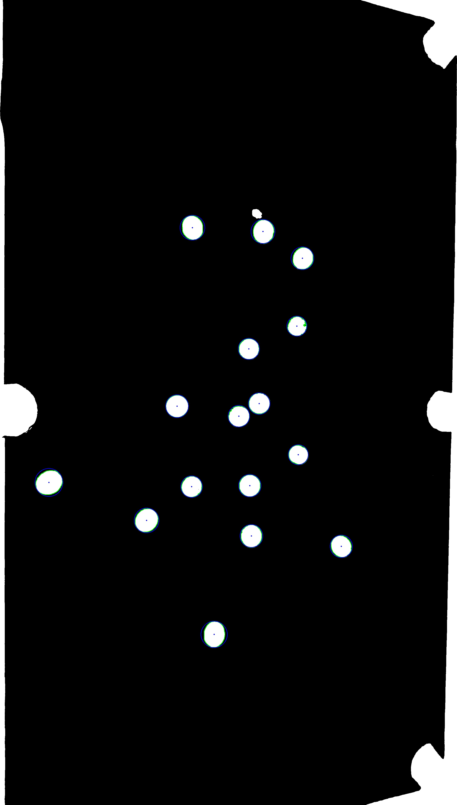
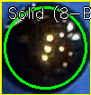
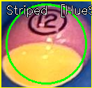
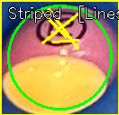

# CompRobo FA25: Eightball Vision — Pool Ball Detection and Classification

Chang Jun Park  
Akshat Jain

## Project Overview

This project explores multiple computer vision approaches to detect pool balls on a table and to classify each ball as either striped or solid. We implemented and compared classic CV pipelines (color segmentation, Hough-based circle detection) and a lightweight ML detector (Roboflow) for ball localization. For classification, we evaluated several simple-yet-effective heuristics based on color statistics, edge density, and line detection.


## Repository Layout (vision components)

- `approaches/circle_detection/`
	- `color_segmentation.py`: Classical felt/mat masking + contour filtering to find balls
	- `hough_circle_detection.py`: Hough Circles approach with mat masking to find balls
	- `roboflow_ball_detection.py`: Uses a Roboflow model to detect balls and save crops
	- `results/…`: Annotated images and cropped detections
- `approaches/striped_classfication/`
	- `white_pixel_classifier.py`: Classifies using white/black pixel ratios inside the ball region
	- `hue_std_classifier.py`: Classifies using hue standard deviation (color variance) within the ball region
	- `hough_lines_classifier.py`: Uses straight‑line detections within the ball region
	- `results/…`: Annotated overlays for each crop
- `data/` and `output_images/`: Example images and outputs

## Finding the Balls (Circle Detection)

We use three different ways to find balls. Each one saves pictures in `approaches/circle_detection/results/<method_name>/` so you can see what happened.

#### Color segmentation (`color_segmentation.py`)

Pool felt is usually one dominant color. We convert the image to HSV, build a simple hue histogram, and pick the hue with the biggest count as “felt.” Then we make a hue band around that value and mark those pixels as felt. Flip the mask: now we have “not felt,” which is where balls live. From those regions we find contours and keep only ones that look roughly round, are within a sensible size range, and have a reasonable radius. The survivors become our detected balls. This works well when the table color is clear and different from ball colors. It stumbles when a ball color is too close to the felt or the lighting creates shadows and glare. In those cases small tweaks to the hue margin or a light contrast normalization help.

```python
hsv = cv2.cvtColor(bgr, cv2.COLOR_BGR2HSV)
hist = cv2.calcHist(hsv.astype(np.uint8), [0], None, [180], [0, 180])
dominant_hue = int(np.argmax(hist))
hue_margin = 25
lower = np.array([max(dominant_hue - hue_margin, 0), 40, 40])
upper = np.array([min(dominant_hue + hue_margin, 179), 255, 255])
mat_mask = cv2.inRange(hsv, lower, upper)
balls_mask = cv2.bitwise_not(mat_mask)

perimeter = cv2.arcLength(cnt, True)
circularity = 4 * np.pi * area / (perimeter * perimeter)
```



#### Hough circles (`hough_circle_detection.py`)

Here we ignore color and just look for circle shapes. We blur the grayscale image to cut noise and then call `cv2.HoughCircles` with ball‑specific parameters (rough min distance between centers, expected radius range, and thresholds that control how strict the circle check is). If we miss balls we loosen the thresholds; if we get fake circles we tighten them or blur more. This method is simple and fast, but it doesn’t love partial balls or heavy shadows.

```python
circles = cv2.HoughCircles(
	blurred, cv2.HOUGH_GRADIENT,
	dp=1.2, minDist=38,
	param1=100, param2=30,
	minRadius=15, maxRadius=50,
)
```


#### Detection Using ML model (`roboflow_ball_detection.py`)

We send the image to Roboflow, get back bounding boxes, draw them, and save each crop. The pre-trained model handles the detection, so it’s very handy when lighting or felt color tricks the classical methods. You need `ROBOFLOW_API_KEY` exported for it to run.

```python
model = get_model(model_id="balldetect-hefhg/1", api_key=os.getenv("ROBOFLOW_API_KEY"))
result = model.infer(image_path, confidence=0.15, iou_threshold=0.3)[0]
for p in result.predictions:
	x1 = int(p.x - p.width / 2); y1 = int(p.y - p.height / 2)
	x2 = int(p.x + p.width / 2); y2 = int(p.y + p.height / 2)
	crop = bgr[max(0,y1):y2, max(0,x1):x2]
	if crop.size:
		cv2.imwrite(os.path.join(crops_dir_path, f"ball_{i}.png"), crop)
```


Overall, we had the best results using the ML method. Therefore, we moved forward with using the cropepd images from the ML method to classify between striped and solid balls.

## Classifying Striped vs Solid Balls

For classification we start from a single ball crop and apply each attempted method.

#### White/black pixel ratio (`white_pixel_classifier.py`)

For this implmentation, we were inspired by [this paper](https://www.researchgate.net/publication/319313350_Pool_Balls_Identification_and_Calibration_for_a_Pool_Robot). This method classifies a ball by measuring how many pixels inside a central, ball‑sized mask are very bright or very dark. We place a circular region of interest at the crop center with a radius about a portion of the smaller image dimension so we focus on the ball and avoid borders. Within that mask, we compute two percentages: “white” pixels where the R, G, and B channels are all high (for example above 192), and “black” pixels where all three are low (for example below 64). A very high black percentage is a strong indicator for the 8‑ball, while a very high white percentage points to the cue ball. Striped balls usually show a moderate amount of white because of the band, whereas solids tend to stay in the low‑white, low‑black regime. While the thresholds are easy to tune, the main failure modes are specular highlights that inflate the white count and how we had to adjust the threshold for each image every time.

```python
mask = np.zeros(img.shape[:2], dtype="uint8")
cv2.circle(mask, center, radius, 255, -1)
r, g, b = img[:,:,2], img[:,:,1], img[:,:,0]
white_pct = np.mean((r>192) & (g>192) & (b>192) & (mask==255)) * 100
black_pct = np.mean((r<64) & (g<64) & (b<64) & (mask==255)) * 100
```



#### Hue variance (`hue_std_classifier.py`)

This method looks for color diversity inside the ball. After converting the crop to HSV, we first perform two quick checks: if a large fraction of pixels are very dark, we classify as the 8‑ball; if many pixels are low saturation but bright, we classify as the cue ball. If neither applies, we compute the standard deviation of the hue channel over a central circular ROI. Striped balls tend to mix multiple colors and therefore produce a larger hue spread, whereas solids are more uniform and produce a smaller spread. While the method is compact and fairly robust to illumination, it becomes unreliable when the ball’s saturation is very low, since hue is poorly defined near gray.

```python
hsv = cv2.cvtColor(bgr, cv2.COLOR_BGR2HSV)
mask = np.zeros(hsv.shape[:2], dtype="uint8"); cv2.circle(mask, center, radius, 255, -1)
# HSV channels: h = hue, s = saturation (colorfulness), v = value (brightness)
h = hsv[:,:,0][mask==255]; s = hsv[:,:,1][mask==255]; v = hsv[:,:,2][mask==255]
black_pct = np.mean(v < 40); white_pct = np.mean((s < 30) & (v > 180))
hue_std = float(np.std(h))
```



#### Hough lines (`hough_lines_classifier.py`)

This script came from the assumption that striped balls would have a clear straight line across them. Therefore, we run Canny edge detection inside the cropped image and then use `cv2.HoughLinesP` to extract short line segments, with the minimum line length scaled to the ball size and conservative thresholds. If we observe several segments, we label the ball as striped; if we observe none or only a few, we label it as solid. The idea captures that stripe boundaries often form straight, high‑contrast edges, but it is sensitive to curved bands, perspective, blur, and glare.

```python
lines = cv2.HoughLinesP(
	masked, rho=1, theta=np.pi/180, threshold=10,
	minLineLength=int(radius*0.5), maxLineGap=5,
)
is_striped = lines is not None and len(lines) > 2
```




## How to Run

#### Environment Setup

```bash
cd eightball_vision
chmod +x setup_env.sh
./setup_env.sh
```

If you plan to use the Roboflow detector, export your key first:

```bash
export ROBOFLOW_API_KEY=your_key_here
```

#### Generate Ball Crops

```bash
cd eightball_vision/approaches/circle_detection
python3 roboflow_ball_detection.py
```

#### Run Classification Experiments

Each classifier has a hard‑coded `INPUT_PATH` that can point to either a single crop file or a folder of crops. You can adjust the `INPUT_PATH` constant at the top of each script.

```bash
cd eightball_vision/approaches/striped_classfication

# White/Black Pixel Ratio
python3 white_pixel_classifier.py

# Hue Variance
python3 contrast_boundary_classifier.py

# Straight Line Detection
python3 hough_lines_classifier.py
```

## Results

Across the images we tested, the color segmentation method performed best when the table’s felt color was uniform and lighting was even; under those conditions it cleanly isolated balls with minimal false blobs. The Hough circle approach was fast and straightforward but much more sensitive to partial views and harsh shadows—missing balls that were touching pockets or clipped at the frame edge, and occasionally hallucinating circles on high‑contrast felt texture. The Roboflow detector was consistently reliable regardless of lighting shifts or minor occlusions, and its stable crops made downstream stripe/solid classification easier by removing worries about mask alignment.

Among the stripe vs solid classifiers, white pixels and hue variance method gave the most acceptable separation on typical striped balls because stripes tend to introduce internal contrast and color changes. The simpler white/black pixel ratio was excellent at singling out the cue ball and 8‑ball quickly, though occasionally glare inflated the “white” count.

## Challenges Faced

Reliable detection and classification proved sensitive to real-world variability. Small shifts in lighting, camera angle, or exposure often changed the apparent hue of the felt and the brightness of the balls, forcing frequent retuning of thresholds. Shadows were a recurring issue: balls near table edges had strong, irregular shadows cast by the rails, while overhead lights produced specular glare that inflated white-pixel counts or confused circle detectors. Differentiating true ball edges from these shadows was especially difficult for dark balls.

Balls close to pockets were sometimes only half visible, and pockets themselves occasionally generated circular regions that passed early filters. The small placement marker printed on the table also triggered false positives because its geometry resembled a ball. Even when a parameter set worked well for one image, applying it to another images under similar conditions would degrade performance significantly. These inconsistencies highlighted the brittleness of fixed thresholds and emphasized the need for more adaptive components in the pipeline.

## Possible Future Improvements

- Learn a small stripe/solid classifier on the Roboflow crops and compare against heuristics.  
- Replace circular masks with contour‑based masks everywhere for better alignment.  
- Use adaptive thresholds by estimating per‑image exposure (e.g., from LAB L channel).  
- Fuse multiple heuristics with a simple meta‑classifier for robustness.
- Adding a LIDAR to differentiate a ball from its shadow

## Lessons Learned

### Akshat

Throughout this project we started with the assumption that classical computer vision would be enough to reliably detect pool balls, but working through multiple masking strategies made clear how fragile these methods can be in practice. Small changes in lighting or glare often forced us to retune thresholds, and even then the results were inconsistent across images that looked similar to us. This contrast became especially noticeable once we tried a lightweight ML model, which handled many of the same variations with no manual preprocessing. That comparison highlighted how much real-world performance depends on stable imaging conditions, and how quickly classical CV breaks down when those conditions drift. Overall, experimenting with both approaches gave us a better understanding of the trade-offs: classical pipelines are transparent and fast to iterate on, but ML offers far more robustness when dealing with the messy variability of actual camera data.

### Jun

Going into this project, our goal was to track scores by detecting and classifying every ball reliably. We didn’t get all the way there, and I underestimated how hard it is to identify pool balls using only classical computer vision. Small changes in lighting, exposure, felt color, camera angle, or crop quality pushed us to retune thresholds and revise assumptions over and over. That experience made it clear that, for some real‑time or high‑volume applications, purely classical methods may not be the best tool—especially when the scene has a lot of variability. While that could be framed as a failure, it actually gave me practical intuition for future similar problems. I’m coming away with a better sense of when to choose heuristics, when to adapt parameters, and when to switch approaches entirely.
